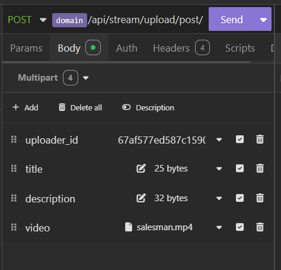
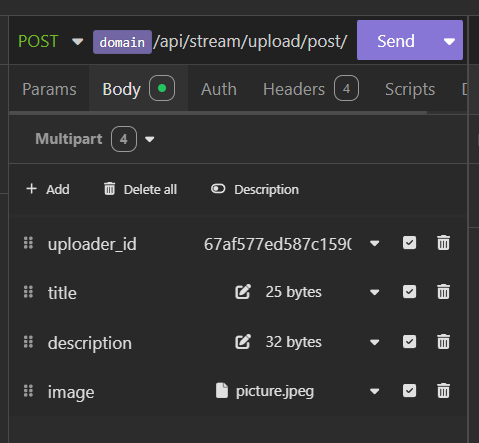
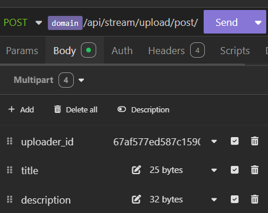

# Streaming Service API

# Posts
Will be used to upload or get posts of users through `uploader_id` or user_id of user.
### Upload Posts *(Post request)*
End point:
```bash
http://65.0.179.194:7256/api/stream/upload/post/
```
#### Example Input:
#### For Video

This will upload the video post of user.

#### For images


#### For Text


## Get All Post of User *(Get request)*
```bash
http://65.0.179.194:7256/api/stream/get/posts/
```
#### Example Input
```json
{
	"uploader_id" : "67af577ed587c1590050e378"
}
```
**Desired OUPUT**
```json
{
	"status": "success",
	"posts": [
		{
			"title": "Engineering College bruh",
			"description": "No description provided",
			"likes": 0,
			"shares": 0,
			"upload_time": "2025-02-16T07:14:23.737000Z",
			"post_type": "Image",
			"image_link": "https://django-react-test-bucket.s3.amazonaws.com/videos/cfb04158-0caa-4621-a41d-6b4e2f717de6/picture.jpeg",
			"video_link": null,
			"thumbnail_link": null,
			"post_uploaded_ago": "29 minutes ago",
			"uploader_details": {
				"user_name": "manas12",
				"profile_picture": "http://65.0.179.194:7256/static/default-profile.jpg"
			}
		},
		{
			"title": "Sales Man being sales man",
			"description": "No description provided",
			"likes": 0,
			"shares": 0,
			"upload_time": "2025-02-16T07:21:49.128000Z",
			"post_type": "Video",
			"image_link": null,
			"video_link": "https://django-react-test-bucket.s3.amazonaws.com/videos/58c89180-13dc-47ee-b430-17f0f796f88d/salesman.mp4",
			"thumbnail_link": "https://django-react-test-bucket.s3.amazonaws.com/videos/675dd131-dde0-487b-9e3f-da43e7bb7733/thumbnail.jpg",
			"post_uploaded_ago": "22 minutes ago",
			"uploader_details": {
				"user_name": "manas12",
				"profile_picture": "http://65.0.179.194:7256/static/default-profile.jpg"
			}
		},
		{
			"title": "Sales Man being sales man",
			"description": "No description provided",
			"likes": 0,
			"shares": 0,
			"upload_time": "2025-02-16T07:23:15.048000Z",
			"post_type": "Text",
			"image_link": null,
			"video_link": null,
			"thumbnail_link": null,
			"post_uploaded_ago": "21 minutes ago",
			"uploader_details": {
				"user_name": "manas12",
				"profile_picture": "http://65.0.179.194:7256/static/default-profile.jpg"
			}
		}
	]
}
```
This will return **array of objects** of **Posts** of `uploder_id`.
